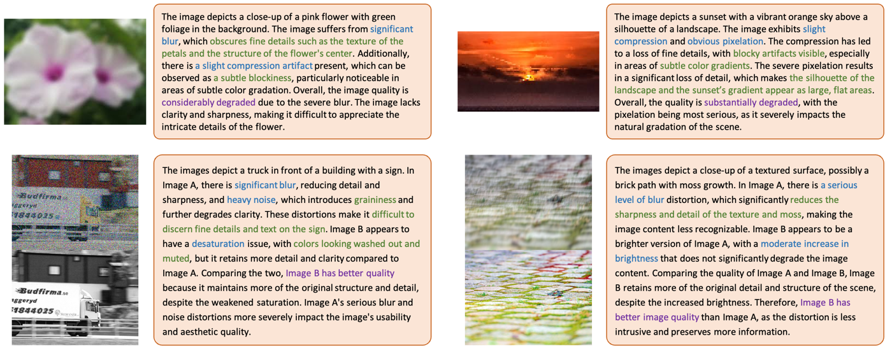
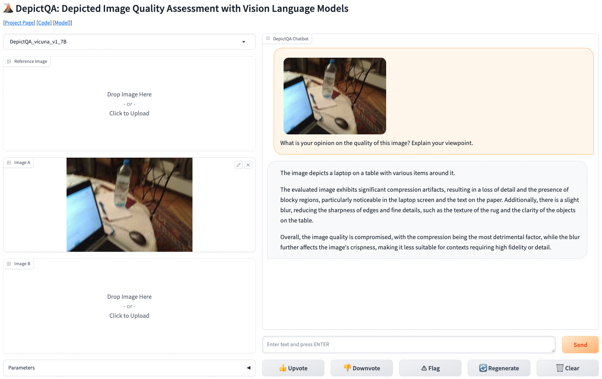

# DepictQA: Depicted Image Quality Assessment with Vision Language Models


<p align="center">
    
</p>


<p align="center">
    <font size='4'>
        <a href="https://depictqa.github.io/" target="_blank">🌏 Project Page</a> • 🤗 Demo (coming) • 📀 Data (coming) • Models (coming)
    </font>
</p>

Official pytorch implementation of the papers: 

- DepictQA-Wild (DepictQA-V2): [paper](https://arxiv.org/abs/2405.18842), [project page](https://depictqa.github.io/depictqa-wild/). 

    Zhiyuan You, Jinjin Gu, Zheyuan Li, Xin Cai, Kaiwen Zhu, Chao Dong, and Tianfan Xue. "Descriptive Image Quality Assessment in the Wild." arXiv preprint arXiv:2405.18842 (2024).

- DepictQA: [paper](https://arxiv.org/abs/2312.08962), [project page](https://depictqa.github.io/depictqa-v1/). 

    Zhiyuan You, Zheyuan Li, Jinjin Gu, Zhenfei Yin, Tianfan Xue, and Chao Dong. "Depicting beyond scores: Advancing image quality assessment through multi-modal language models." arXiv preprint arXiv:2312.08962 (2023).

<p align="center">
    
</p>


## Update

📆 [Coming soon] Online demo. 

📆 [2024.05] We release [DepictQA-Wild](https://depictqa.github.io/depictqa-wild/) (DepictQA-V2): a multi-functional in-the-wild descriptive image quality assessment model.

📆 [2023.12] We release [DepictQA](https://depictqa.github.io/depictqa-v1/), a multi-modal image quality assessment model based on vision language models.

## Installation

- Create environment. 

    ```
    # clone this repo
    git clone https://github.com/XPixelGroup/DepictQA.git
    cd DepictQA

    # create environment
    conda create -n depictqa python=3.10
    conda activate depictqa
    pip install -r requirements.txt
    ```

- Download pretrained models. 
    - [CLIP-ViT-L-14](https://openaipublic.azureedge.net/clip/models/b8cca3fd41ae0c99ba7e8951adf17d267cdb84cd88be6f7c2e0eca1737a03836/ViT-L-14.pt). Required. 
    - [Vicuna-v1.5-7B](https://huggingface.co/lmsys/vicuna-7b-v1.5). Required. 
    - [All-MiniLM-L6-v2](https://huggingface.co/sentence-transformers/all-MiniLM-L6-v2). Optional, for confidence estimation of detailed reasoning responses. 
    - Our pretrained delta checkpoint (coming soon). Optional, for demo or inference. 


- Ensure that all downloaded models are placed in the designated directories as follows. 
    ```
    |-- DepictQA
    |-- ModelZoo
        |-- CLIP
            |-- clip
                |-- ViT-L-14.pt
        |-- LLM
            |-- vicuna
                |-- vicuna-7b-v1.5
        |-- SentenceTransformers
            |-- all-MiniLM-L6-v2
    ```

    If models are stored in different directories, revise _config.model.vision\_encoder\_path_, _config.model.llm\_path_, and _config.model.sentence\_model_ in _config.yaml_ (under the experiments directory) to set new paths. 


- Move our pretrained delta checkpoint to a specific experiment directory (_e.g._, DQ-495K) as follows. 

    ```
    |-- DepictQA
        |-- experiments
            |-- DQ-495K
                |-- ckpt
                    |-- ckpt.pt
    ```

    If the delta checkpoint is stored in another directory, revise _config.model.delta\_path_ in _config.yaml_ (under the experiments directory) to set new path. 


## Demos

<p align="center">
    
</p>

### Online Demo

We provide an online demo (coming soon) deployed on huggingface spaces.

### Gradio Demo

We provide a gradio demo for local test. 

- cd the experiment directory: `cd experiments/DQ-495K`

- Check [Installation](#installation) to make sure (1) the environment is installed, (2) CLIP-ViT-L-14, Vicuna-v1.5-7B, and the pretrained delta checkpoint are downloaded and (3) their paths are set in _config.yaml_. 

- Launch controller: `sh launch_controller.sh`

- Launch gradio server: `sh launch_gradio.sh`

- Launch DepictQA worker: `sh launch_worker.sh`

You can revise the server config in _serve.yaml_. The url of deployed demo will be _http://{serve.gradio.host}:{serve.gradio.port}_. The default url is http://0.0.0.0:12345 if you do not revise _serve.yaml_. 


## DQ-495K Dataset

- See details of our DQ-495K dataset construction in [here](./build_datasets/). 

- Download DQ-495K dataset from huggingface (coming soon). Move the dataset to the same directory of this repository as follows. 

    ```
    |-- DataDepictQA
    |-- DepictQA
    ```

    If the dataset is stored in another directory, revise _config.data.root\_dir_ in _config.yaml_ (under the experiments directory) to set new path. 


## Training

- cd the experiment directory: `cd experiments/DQ-495K`

- Check [Installation](#installation) to make sure (1) the environment is installed, (2) CLIP-ViT-L-14 and Vicuna-v1.5-7B are downloaded and (3) their paths are set in _config.yaml_. 

- Run training: `sh train_dq495k.sh`. 


## Inference

### Inference on Our Benchmark

- cd the experiment directory: `cd experiments/DQ-495K`

- Check [Installation](#installation) to make sure (1) the environment is installed, (2) CLIP-ViT-L-14, Vicuna-v1.5-7B, and the pretrained delta checkpoint are downloaded and (3) their paths are set in _config.yaml_. 

- Run a specific infer shell (_e.g._, _infer_A_sd_brief.sh_): `sh infer_A_sd_brief.sh id_of_one_gpu`.

### Inference on Custom Dataset

- Construct _*.json_ file for your dataset as follows.

    ```
    [
        {
            "id": unique id of each sample, required, 
            "image_ref": reference image, null if not, 
            "image_A": image A, null if not, 
            "image_B": image B, null if not, 
            "query": input question to DepictQA, required, 
        }, 
        ...
    ]

    ```

- cd your experiment directory: `cd your_experiment_directory`

- Check [Installation](#installation) to make sure (1) the environment is installed, (2) CLIP-ViT-L-14, Vicuna-v1.5-7B, and the pretrained delta checkpoint are downloaded and (3) their paths are set in _config.yaml_. 

- Construct infer shell as follows.

    ```
    #!/bin/bash
    src_dir=directory_of_src
    export PYTHONPATH=$src_dir:$PYTHONPATH
    export CUDA_VISIBLE_DEVICES=$1

    python $src_dir/infer.py \
        --meta_path json_path_of_your_dataset \
        --dataset_name your_dataset_name \
        --task_name task_name \
        --batch_size batch_size \
    ```

    `--task_name` can be set as follows. 

    | Task Name | Description |
    | -------- | -------- |
    | _quality\_compare_ | AB comparison in full-reference |
    | _quality\_compare\_noref_ | AB comparison in non-reference |
    | _quality\_single\_A_ | Image A assessment in full-reference |
    | _quality\_single\_A\_noref_ | Image A assessment in non-reference |
    | _quality\_single\_B_ | Image B assessment in full-reference |
    | _quality\_single\_B\_noref_ | Image B assessment in non-reference |

- Run your infer shell : `sh your_infer_shell.sh id_of_one_gpu`.


## Evaluation

- cd the evaluation directory: `cd src/eval`. 

- Various evaluation scripts are explained as follows. 

    | Script | Description |
    | -------- | -------- |
    | `cal_acc_single_distortion.py` | accuracy of single-distortion identification |
    | `cal_acc_multi_distortion.py` | accuracy of multi-distortion identification |
    | `cal_acc_rating.py` | accuracy of instant rating |
    | `cal_gpt4_score_detail.py` | GPT-4 score of detailed reasoning tasks |

- Run basic evaluation (_e.g._, _cal\_acc\_single\_distortion.py_): 

    ```python cal_acc_single_distortion.py --pred_path predict_json_path --gt_path ground_truth_json_path```

    Some specific parameters are explained as follows. 

    For the calculation of accuracy: 
    - `--confidence` (store_true): whether to calculate accuracy within various confidence intervals. 
    - `--intervals` (list of float, default [0, 0.5, 0.6, 0.7, 0.8, 0.9, 0.95, 1]): the confidence intervals, only valid when `--confidence` is true. 

    For the calculation of GPT-4 score:
    - `--save_path` (str, required): _*.json_ path to save the evaluation results including scores and reasons. 


## Acknowledgement

This repository is based on [LAMM](https://github.com/OpenGVLab/LAMM/tree/main). Thanks for this awesome work.


## BibTeX

If you find our work useful for your research and applications, please cite using the BibTeX:

```
@article{depictqa_v2,
    title={Descriptive Image Quality Assessment in the Wild},
    author={You, Zhiyuan and Gu, Jinjin and Li, Zheyuan and Cai, Xin and Zhu, Kaiwen and Dong, Chao and Xue, Tianfan},
    journal={arXiv preprint arXiv:2405.18842},
    year={2024}
}


@article{depictqa_v1,
    title={Depicting Beyond Scores: Advancing Image Quality Assessment through Multi-modal Language Models},
    author={You, Zhiyuan and Li, Zheyuan and Gu, Jinjin and Yin, Zhenfei and Xue, Tianfan and Dong, Chao},
    journal={arXiv preprint arXiv:2312.08962},
    year={2023}
}
```
