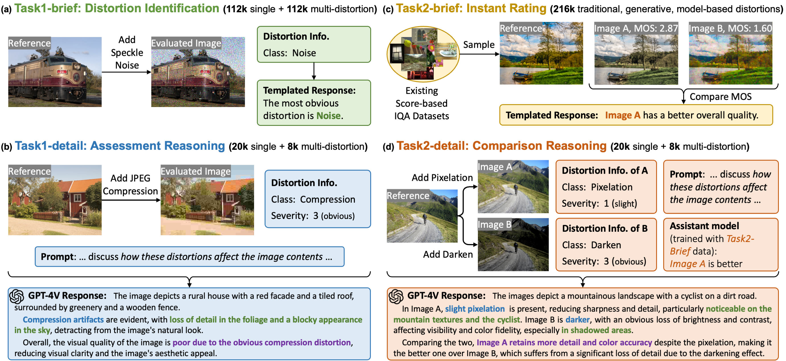

# DQ-495K Dataset Construction

Official python implementation of the DQ-495K dataset construction in [Descriptive Image Quality Assessment in the Wild](https://arxiv.org/abs/2405.18842).



## Quick Start

- **Set up environment**. 

    ```
    cd build_datasets
    conda create -n datadepictqa python=3.10
    conda activate datadepictqa
    pip install -r requirements.txt
    ```

- **Execute scripts**. Take `gen_resp_gpt4v_refA_sd.py` as an example. 

    ```
    PYTHONPATH=./ python scripts/gen_resp_gpt4v_refA_sd.py --meta_dir directory_of_meta_paths --save_dir directory_of_generated_responses --fail_dir directory_of_failure_cases
    ```

    See details of all scripts in [Functions](#functions). 

## Scripts

### Abbreviations

| Abbreviation | Description |
| --------     | --------    |
| refA         | reference & a distorted image    |
| refAB        | reference & two distorted images |
| refA_brief   | full-reference distortion identification |
| A_brief      | non-reference distortion identification  |
| refA_detail  | full-reference assessment reasoning |
| A_detail     | non-reference assessment reasoning  |
| refAB_brief  | full-reference instant rating |
| AB_brief     | non-reference instant rating  |
| refAB_detail | full-reference comparison reasoning |
| AB_detail    | non-reference comparison reasoning  |
| sd    | single-distortion |
| md    | multi-distortion  |

### Functions

| Function | Description |  Example |
| -------- | --------    | -------- |
| `add_distortion_*.py`  | add distortion into reference to create distorted images | `add_distortion_refA_md.py`: add multiple distortions into reference to generate one distorted image |
| `gen_resp_gpt4v_*.py` | use GPT-4V to generate detailed reasoning responses | `gen_resp_gpt4v_refAB_sd.py`: use GPT-4V to generate comparison reasoning responses in single-distortion case |
| `gen_json_*.py`        | generate _\*.json_ file used in training or inference | `gen_json_refA_brief_md.py`: generate _\*.json_ file for distortion identification in multi-distortion case and full-reference setting |
| `refA2A_{sd/md}.py`, `refAB2AB_{sd/md}.py` | convert _\*.json_ file of detailed reasoning tasks from full-reference to non-reference | `refAB2AB_md.py` : convert _\*.json_ file of comparison reasoning in multi-distortion case from full-reference to non-reference |
| `refAB2AB_brief.py` | convert _\*.json_ file of instant rating from full-reference to non-reference | N/A |

Note that for distortion identification, there is no conversion function from full-reference to non-reference, because the questons in these two settings are different and the _\*.json_ files are generated independently. 

## Tests

Test distortion functions under `./build_datasets/x_distortion/`. 

```
PYTHONPATH=./ python tests/test_distortion.py -d distortion_name
```

## Acknowledgement

We use some codes from [imagecorruptions](https://github.com/bethgelab/imagecorruptions) and we also refer to the implementations in [PieAPP](https://arxiv.org/abs/1806.02067) and [KADIS-700K](https://arxiv.org/abs/2001.08113).

## BibTeX

If you find our work useful for your research and applications, please cite using the BibTeX:

```
@article{depictqa_v2,
    title={Descriptive Image Quality Assessment in the Wild},
    author={You, Zhiyuan and Gu, Jinjin and Li, Zheyuan and Cai, Xin and Zhu, Kaiwen and Dong, Chao and Xue, Tianfan},
    journal={arXiv preprint arXiv:2405.18842},
    year={2024}
}


@article{depictqa_v1,
    title={Depicting Beyond Scores: Advancing Image Quality Assessment through Multi-modal Language Models},
    author={You, Zhiyuan and Li, Zheyuan and Gu, Jinjin and Yin, Zhenfei and Xue, Tianfan and Dong, Chao},
    journal={arXiv preprint arXiv:2312.08962},
    year={2023}
}
```
